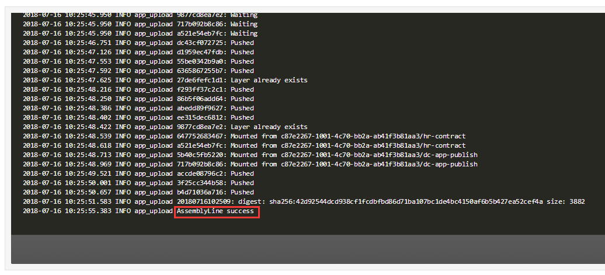
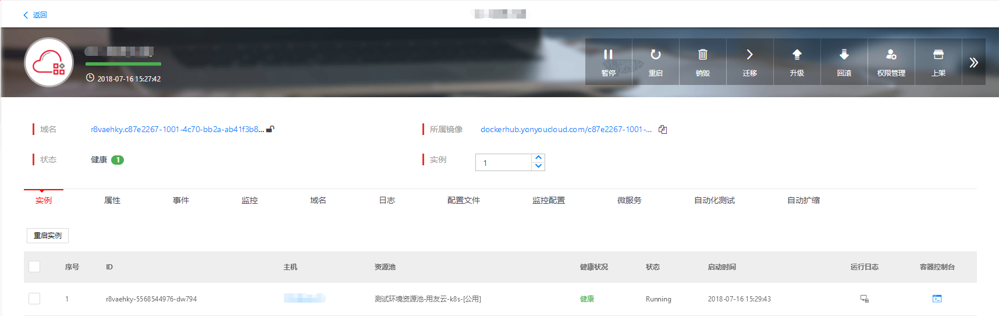

# 如何快速创建一个应用

第一步：登录开发者中心后，点击左侧菜单中“持续集成”，点击左上角“创建流水线”按钮。

图 1

第二步：按要求填写应用名称等信息，选择应用所在产品线；选择应用类型，上传对应格式的应用包，选择基础镜像以及运行环境等信息。

图 2

图 3

第三步：点击最下面的“创建应用”，此时流水线方式构建的应用已被创建并自动执行。等待日志框中出现“AssemblyLine success”字样，则表示应用构建并部署完成。

图 4

图 5

应用部署完成后，点击“应用管理”按钮，即可跳转至应用对应的管理页面。

图 6

图 7

