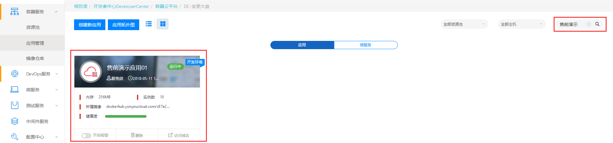
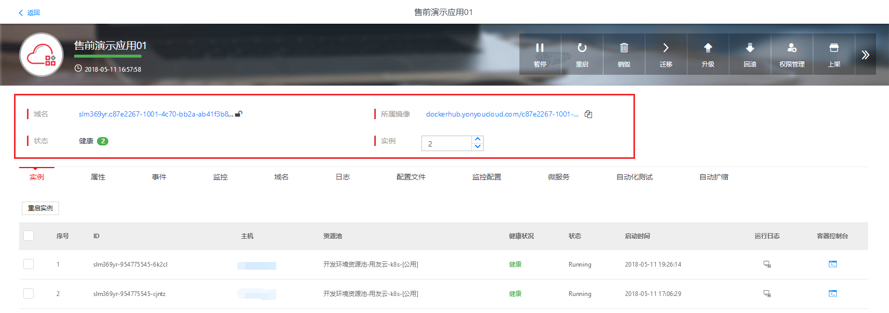
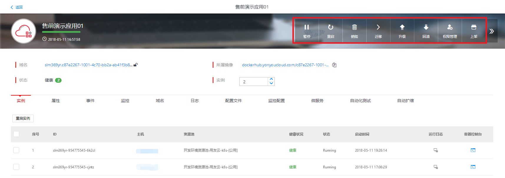
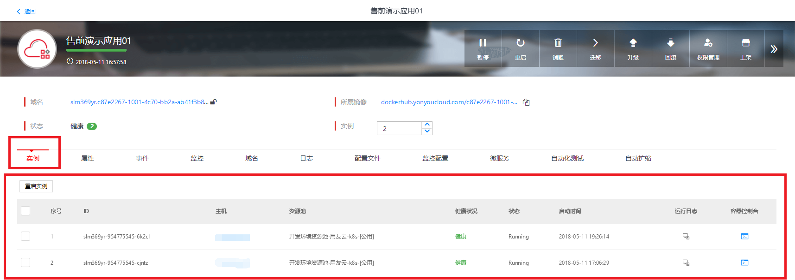

# 如何管理已部署的应用

在应用管理中找到您已经部署的应用，可通过页面右上方的搜索栏，快速找到要管理的应用。点击应用，进入应用详情页。

图 1

此时可查看应用的域名、健康状况、实例数等信息。

图 2

页面上方也提供了暂停、重启、销毁、迁移、升级、回滚、权限管理、上架等按钮，可控制应用的运行状态，进行升级或回滚版本等操作。

图 3

在实例页签，可查看当前应用的各个实例的运行状态，所在资源池及主机等信息。

图 4

