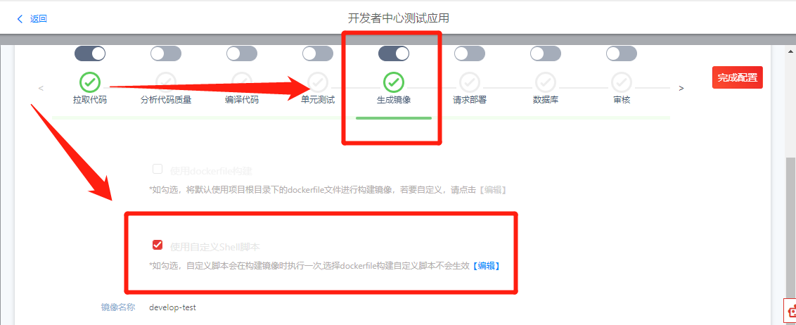
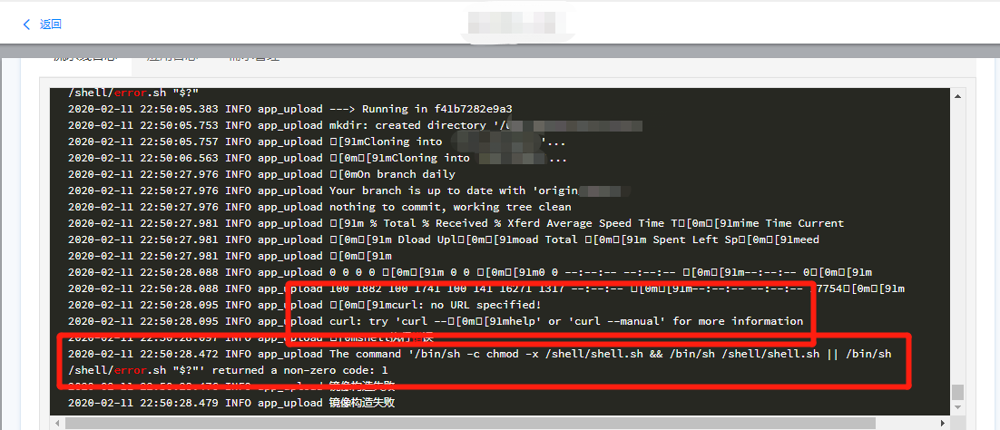

# The command '/bin/sh -c chmod -x /shell/shell.sh && /bin/sh /shell/shell.sh || /bin/sh /shell/error.sh "\$?"' returned a non-zero code: 1

## 报错原因

在【生成镜像】里面使用了【使用自定义 shell 脚本】，如下图所示：

  

在执行【自定义 shell 脚本】脚本的过程中，出现了报错，导致脚本异常退出，最终导致构建镜像失败，如下图所示：

  

## 解决办法

### 方案 1

检查【自定义 shell 脚本】，查出报错来源。

### 方案 2

停用【自定义 shell 脚本】。
