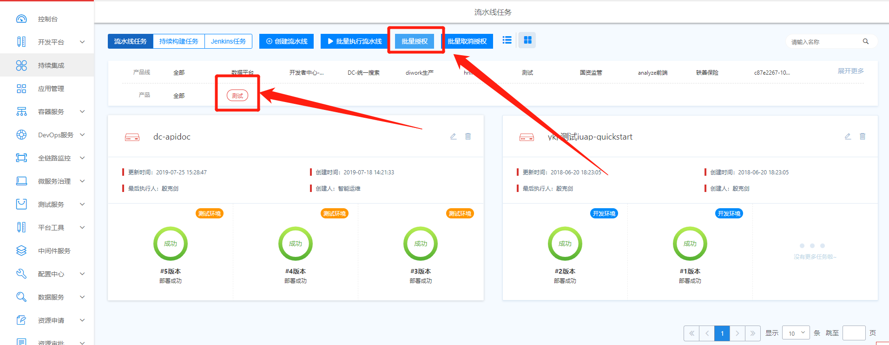
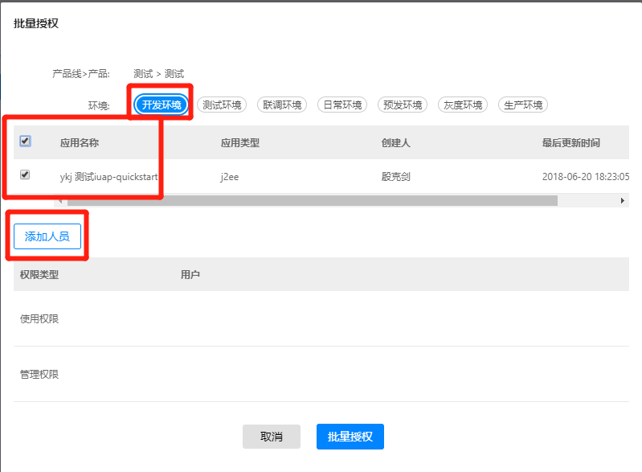
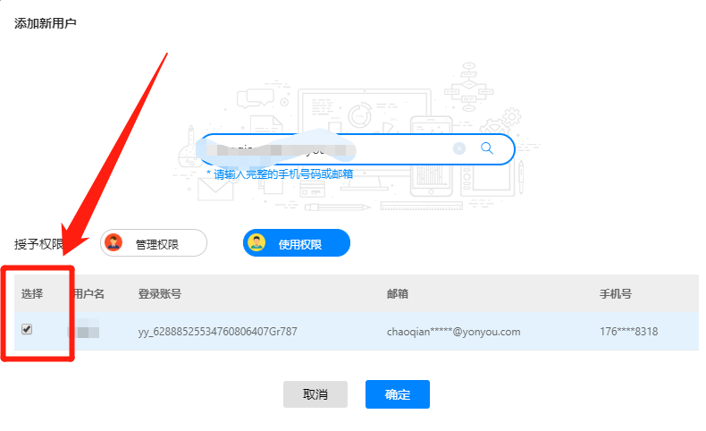
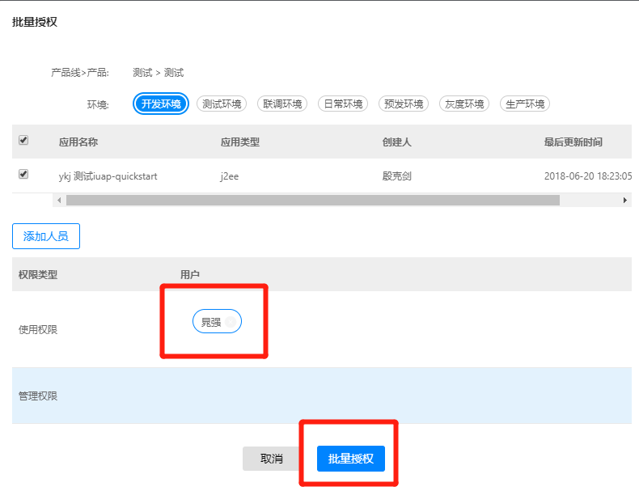
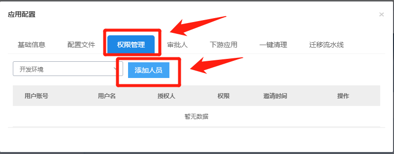
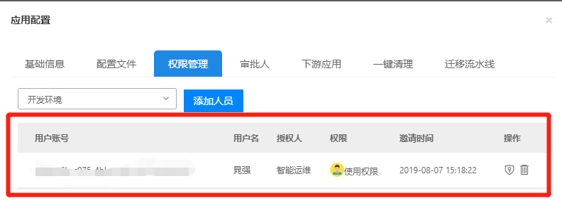

# 应用授权

## 批量授权

打开开发者中心-【持续集成】，选择需要授权的【产品线】和【产品】，如下图所示。**注意：必须选择【产品】，因为授权是【产品】为基础。**

选择【产品】之后，点击【批量授权】，会弹出授权对话框，选择【环境】以及需要授权的【应用】，点击【添加人员】，如下图所示：

输入需要授权人的【邮箱】或者【手机号】，【打勾】，然后点击【确定】，如下图所示：

添加完用户之后，点击【批量授权】按钮，即可完成授权。

## 授权单个应用

打开开发者中心-【持续集成】，进入需要授权的流水线，点击【右上角】的【应用配置】，如下图所示：

选择【权限管理】，然后点击【添加人员】，如下图所示：

输入需要授权人的【邮箱】或者【手机号】，【打勾】，然后点击【确定】，如下图所示：

添加需要授权的人，即可完成授权，如下图所示：

## 备注1：使用权限和管理权限的区别

- 使用权限：仅可执行流水线，不能修改、添加配置文件，不能给别人授权
- 管理权限：拥有流水线的所有权限
