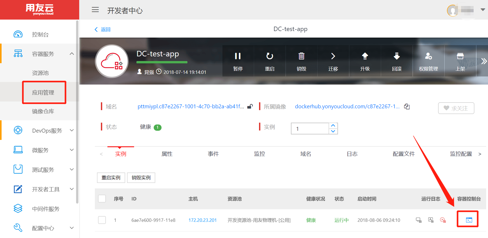
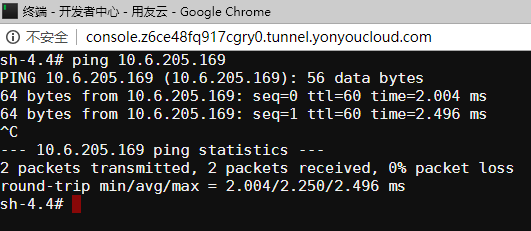
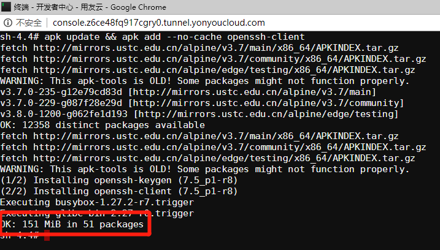
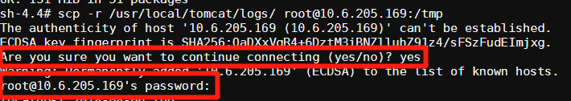
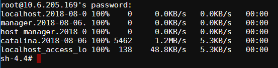
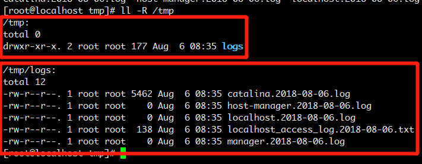

# 拷贝容器内文件到用户Linux服务器

----

## 前提条件

- 用户需要拥有一台Linux服务器
- 在容器内，能ping通这台服务器的ip

假设我的Linux服务器ip为：`10.6.205.169`。

假设我在开发者中心创建的应用为：`DC-test-app`。

现在需要将`/usr/local/tomcat/logs`里面的日志文件，拷贝`10.6.205.169`的`/tmp`文件里面上去。

## 进入容器，验证能否ping通Linux服务器ip

如何进入容器控制台，参考图1：

<div align=center>



</div>

<p align="center">图 1</p>

从ping的结果来看，网络是通的，如图2所示：

<div align=center>



</div>

<p align="center">图 2</p>

## 安装`scp`命令

进入容器控制台，执行如下命令：

```
apk update && apk add --no-cache openssh-client
```

得到如下结果说明安装成功，如图3所示：

<div align=center>



</div>

<p align="center">图 3</p>

## 拷贝文件

执行如下命令，拷贝文件：

```
scp -r /usr/local/tomcat/logs/ root@10.6.205.169:/tmp
```

根据提示分别输入`yes`和`10.6.205.169`的`密码`即可，如图4所示：

<div align=center>



</div>

<p align="center">图 4</p>

执行的结果如下，如图5所示：

<div align=center>



</div>

<p align="center">图 5</p>

## 登录`10.6.205.169`查看日志

进入`10.6.205.169`的`/tmp`查看日志，如图6所示：

<div align=center>



</div>

<p align="center">图 6</p>

## 备注

`10.6.205.169`服务器是通过VirtualBox创建的Centos 7，网络模式为：`桥接模式`。

如果您在上述操作过程中遇到任何问题，请联系开发者中心相关人员。