# 通过开发者中心【流水线】创建【私有基础镜像】

## 制作基础镜像

登录开发者中心，点击持续集成，【创建流水线】，填写流水线相关信息，**镜像名称必须以【_ownbase】结尾**，如下图所示：

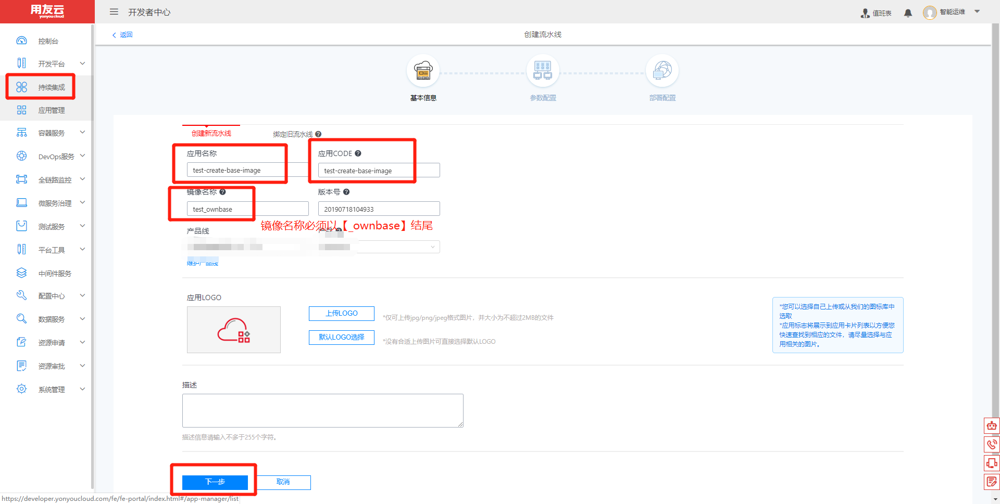

点击【下一步】，上传一个2048的war包，上传完毕之后，点击下一步，如下图所示：

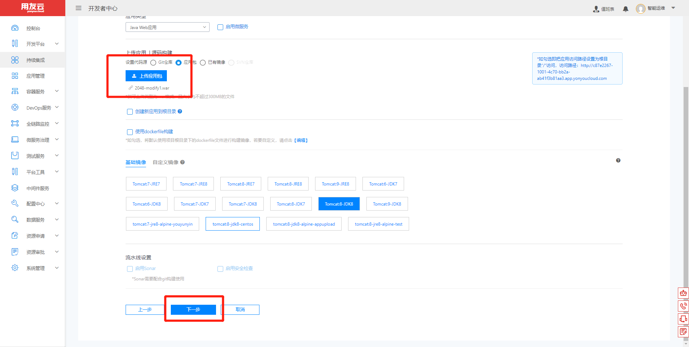

选择一个资源池，点击【创建应用】，如下图所示。

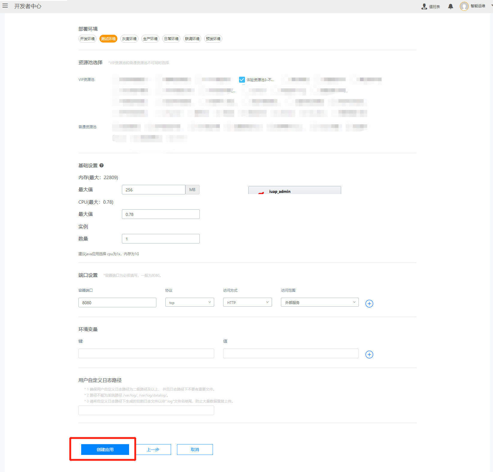

流水线执行完毕之后，点击【应用管理】，如下图所示：

点击【暂停】，如下图所示：

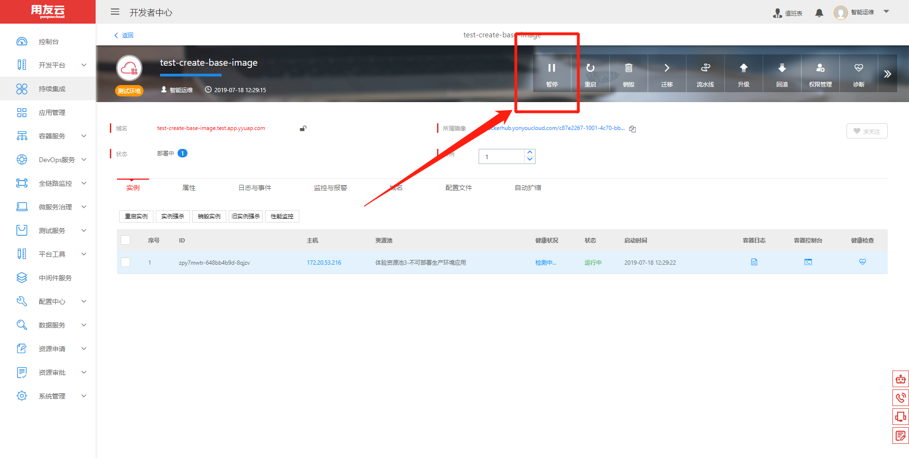

回到流水线，点击编辑流水线，如下图所示：

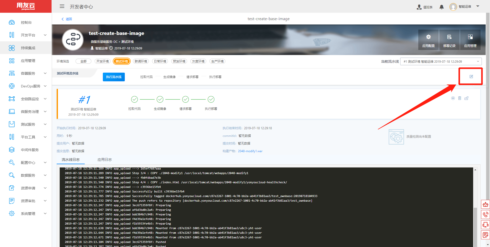

点击【生成镜像】，点击【使用Dockerfile构建】，如下图所示：

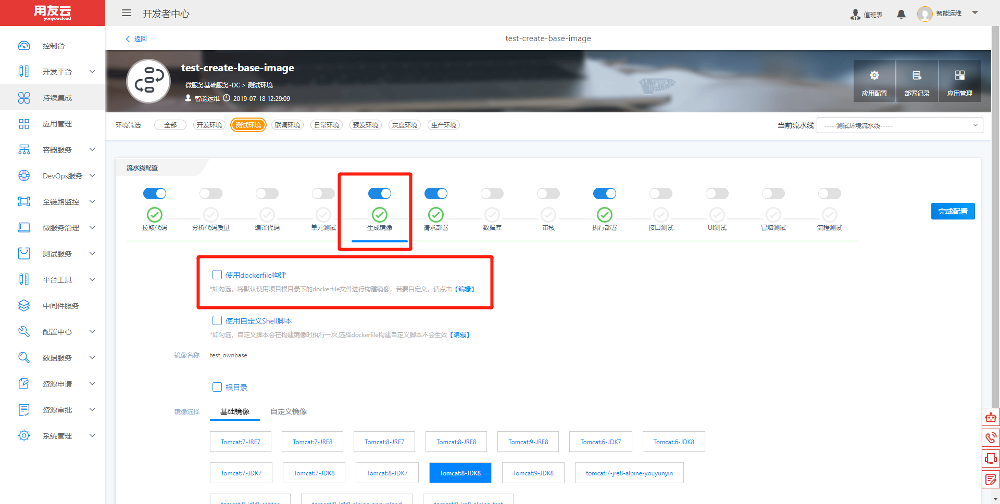

输入生成基础镜像的Dockerfile，并点击【保存】，如下图所示：

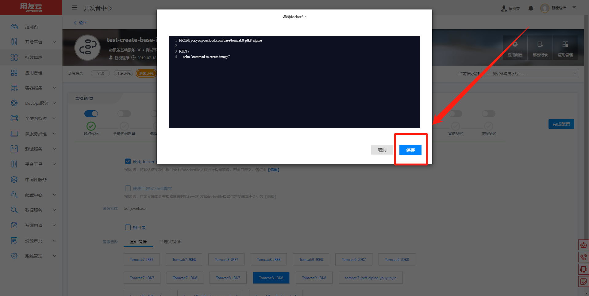

去掉【执行部署】，并点击【完成配置】，如下图所示：

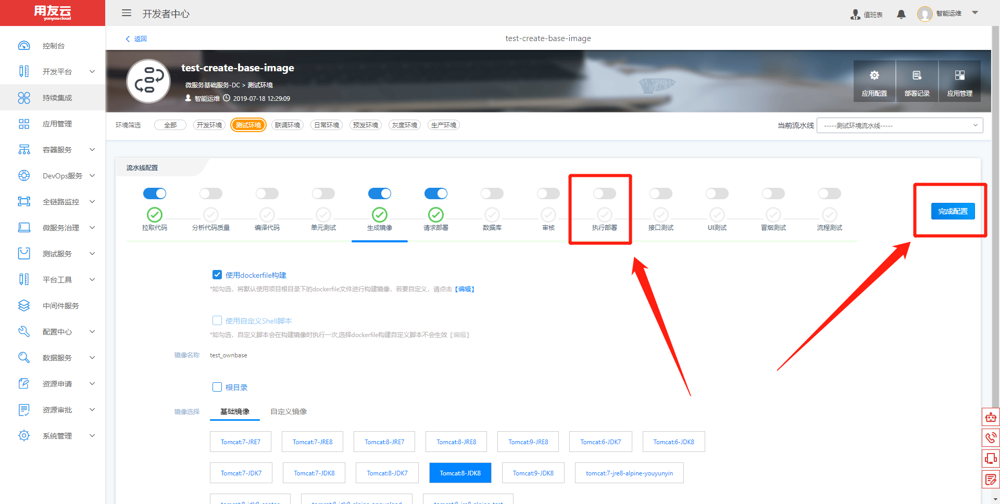

点击【执行流水线】，制作私有基础镜像，如下图所示：

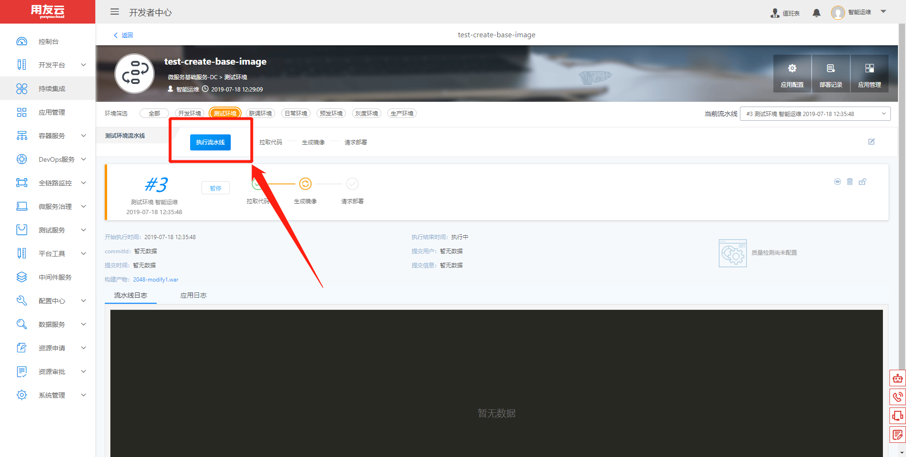

其他流水线即可选择刚刚制作的私有基础镜像，如下图所示：

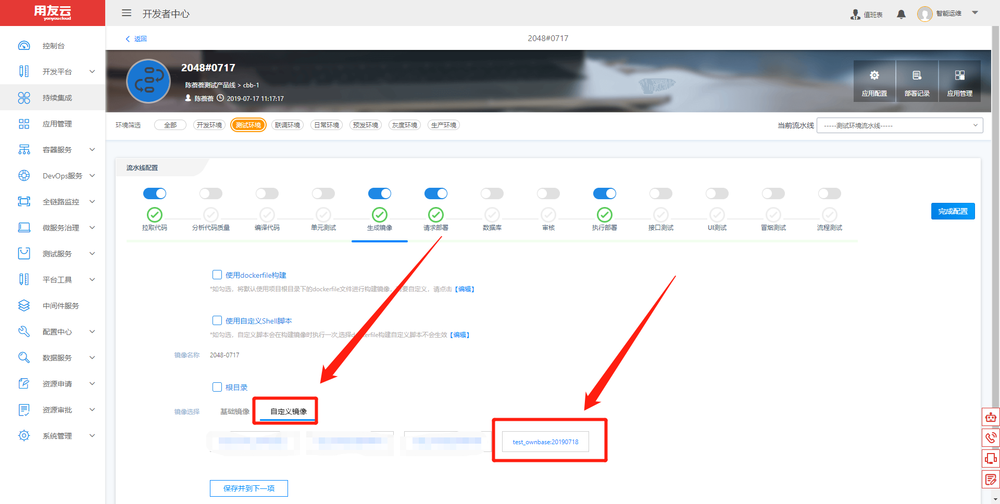

## 管理基础镜像

登录开发者中心，点击【容器服务】-->【镜像仓库】-->【私有镜像】，根据镜像名称找到自己的私有基础镜像，如下图所示：

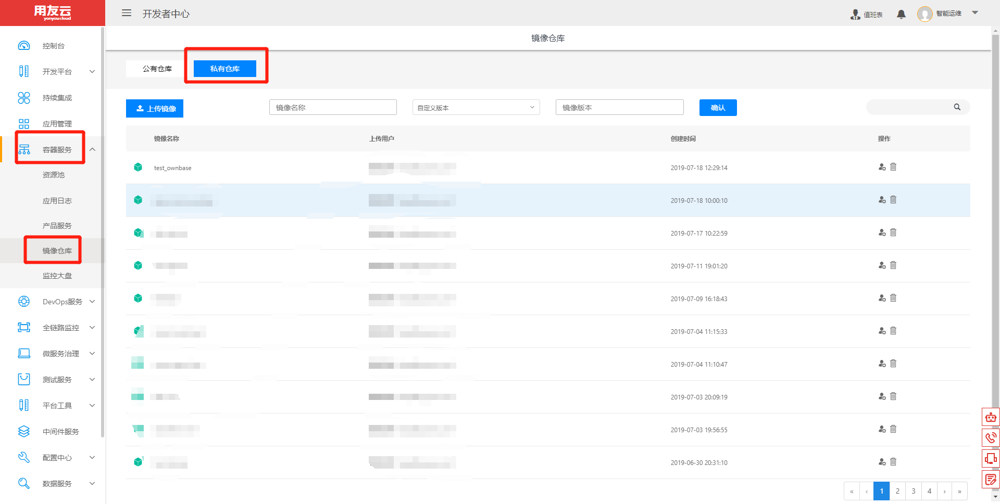

点击自己的私有基础镜像，右侧有删除按钮，可以根据实际情况，删除不需要的版本，如下图所示：

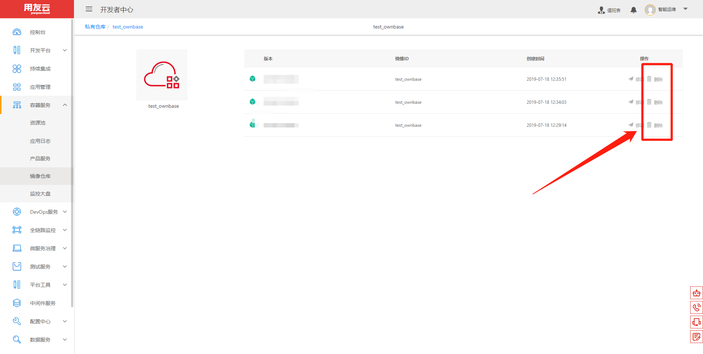
