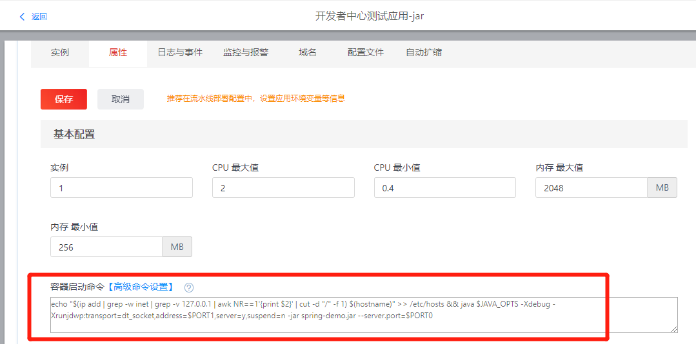
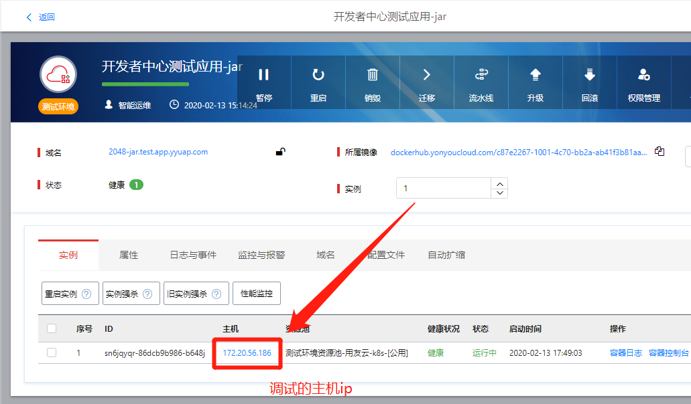
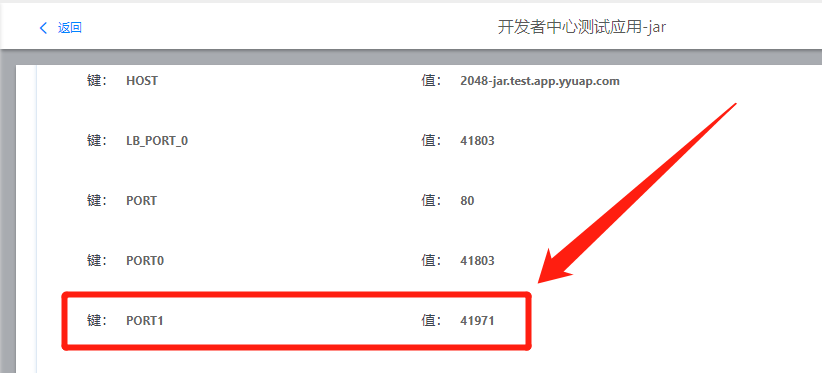

# 宿主机网络模式下添加调试端口

宿主机网络模式添加调试端口和普通网络有些不同，需要手动添加，分为三步：

- [修改启动命令](##修改启动命令)
- [增加端口](##增加端口)
- [查看调试信息](##查看调试信息)

接下来详细介绍这三个步骤。

## 修改启动命令

应用原来的启动命令为：

```shell
java -jar spring-demo.jar
```

修改为：

```shell
echo "$(ip add | grep -w inet | grep -v 127.0.0.1 | awk NR==1'{print $2}' | cut -d "/" -f 1) $(hostname)" >> /etc/hosts && java $JAVA_OPTS -Xdebug -Xrunjdwp:transport=dt_socket,address=$PORT1,server=y,suspend=n -jar spring-demo.jar --server.port=$PORT0
```

其中`$PORT1`为开发者中心分配的调试端口。

修改之后如下图所示：

<div align=center>
  
</div>

## 增加端口

在【应用管理】-【属性】，增加一个端口，如下图所示：

<div align=center>
  
</div>

点击【保存并同步到流水线】

## 查看调试信息

### 查看宿主机 ip

在【应用管理】页面查看容器所在的宿主机为：`172.20.56.186`，如下图所示：

<div align=center>
  
</div>

### 查看调试端口

在【应用管理】-【属性】-【环境变量】里面，查看`PORT1`为：`41971`，如下图所示：

<div align=center>
  
</div>

## 调试信息：`172.20.56.186:41971`
