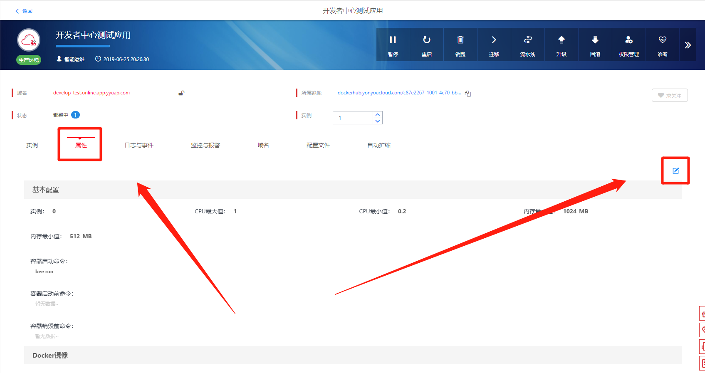
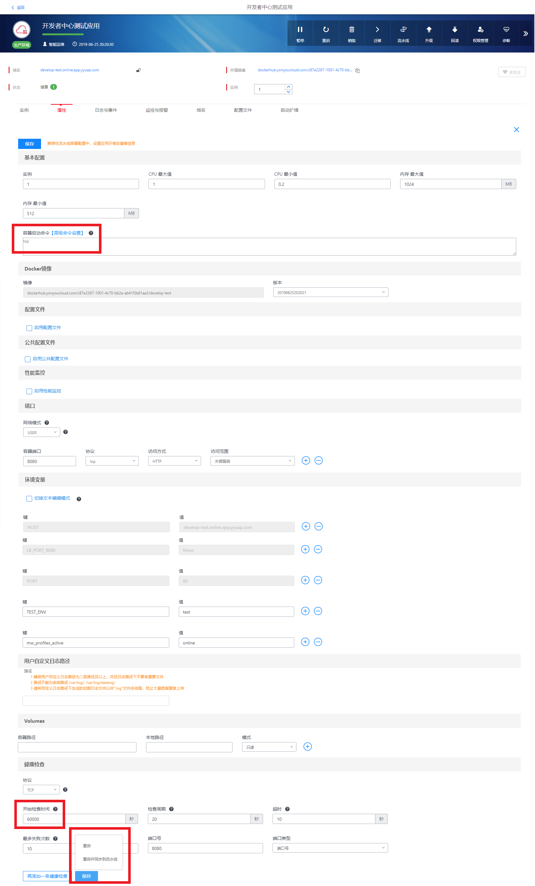
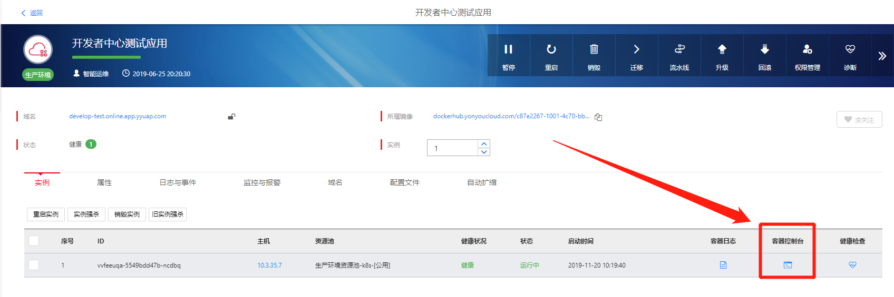
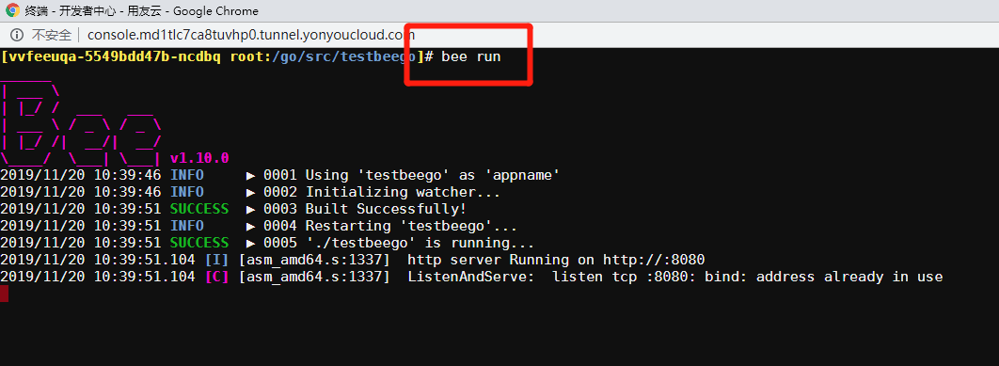
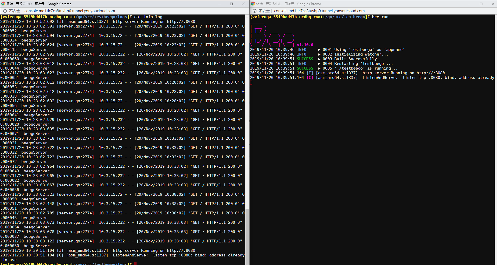

# 手动调试应用

有些应用在启动的过程中，由于启动命令的问题，导致容器异常退出，不能进入**容器控制台**查看日志等信息，**容器日志**也没有详细的报错日志。这个时候，可以使用**手动调试**模式，进入**容器控制台**执行应用的启动命令，查看日志等信息。接下来介绍一下**手动调试**模式开启的方法。

## 1.修改**启动命令**和**开始检查时间**

进入**应用管理**的**属性**页签，点击编辑按钮，如下图所示：

  

将**容器启动命令**修改为：`top`，将**开始检查时间**修改为`60000`，然后点击**保存**，如下图所示：

  

**备注**：

- 将**容器启动命令**修改`top`是为了让容器一直运行不退出
- 将**开始检查时间**修改为`60000`是为了让容器一直处于运行状态，后台管理器不会因为容器不健康把该容器杀掉

## 2.进入**容器控制台**，手动执行启动命令，查看日志等信息

进入**应用管理**，点击**容器控制台**，如下图所示：

  

手动执行启动命令，如下图所示：

  

此时如果想查看日志，可以再打开一个**容器控制台**，如下图所示：

  

## 3.调试完毕，恢复原来的配置

调试完毕之后，将**启动命令**和**开始检查时间**修改为原来的配置即可。
