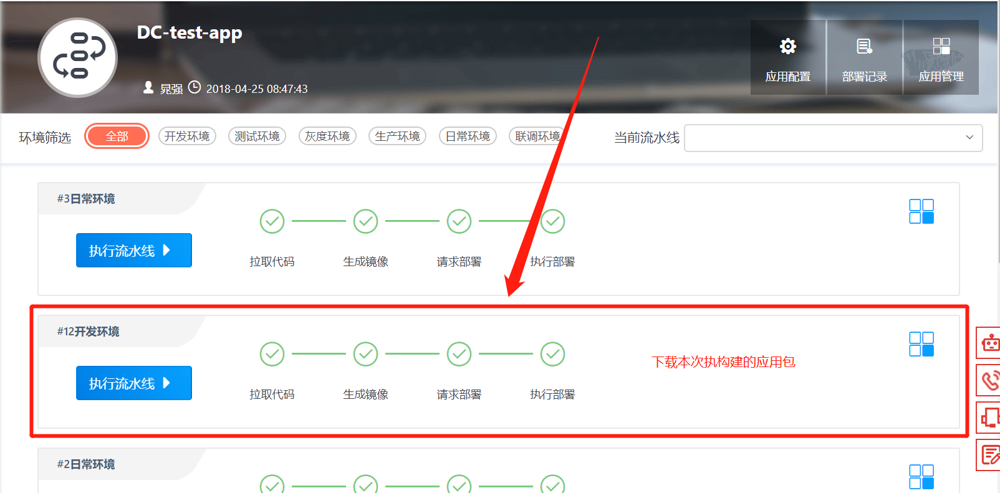
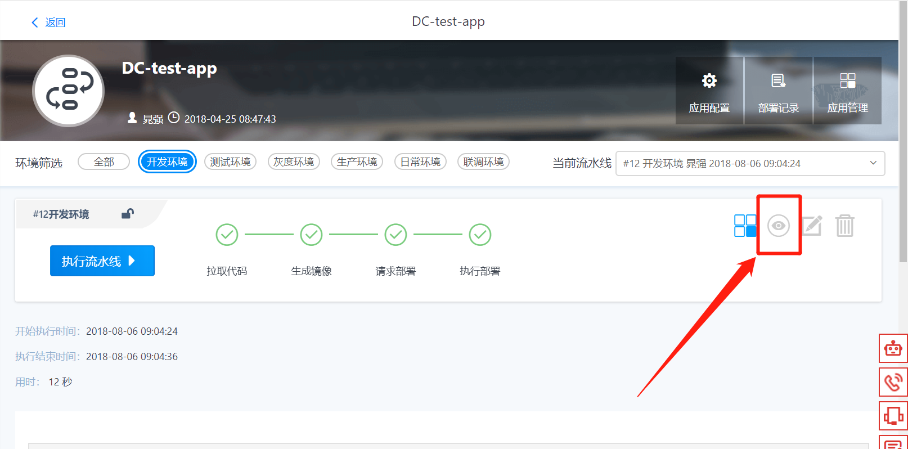
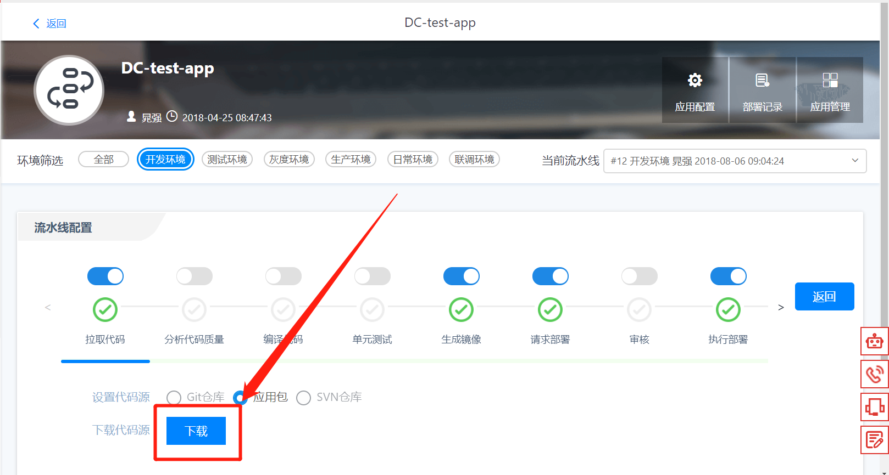

# 下载应用包

----

通过流水线构建的应用，可以下载该应用的应用包。

假设，需要下载DC-test-app的开发环境第12次构建的应用包，如图1所示，具体的方法是：

图 1

1.点击已经执行成功的流水线任务，如图2所示：

图 2

2.在【流水线配置】里面的【**拉取代码**】页签点击【**下载**】按钮，即可下载本次流水线的应用包，如图3所示。

图 3

如果您在此过程中遇到任何问题，请及时联系开发者中心相关人员。