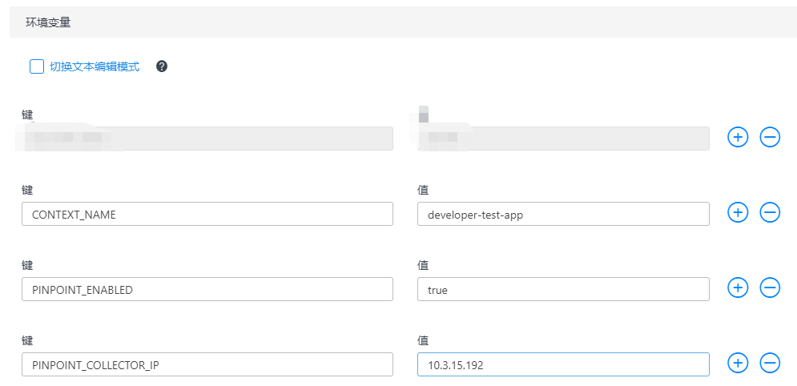

# 如何增加性能监控-pinpoint

Java应用可以通过配置**APM（Application Performance Management/应用性能管理）**来监控应用的性能。

开发者中心提供pinpoint，供大家使用。为应用添加pinpoint的方法如下：

## 1.查看应用是否具有pinpoint基本配置

进入应用的容器后，输入如下命令：

```
cd /usr/local/tomcat/ | ls | grep pinpoint-agent
```

如果出现*pinpoint-agent*，则说明应用有pinpoint基本配置，可以添加pinpoint监控。

如果没有，则需要修改基础镜像的版本，请重新创建应用，或者联系开发者中心相关人员。

## 2.修改环境变量
在【应用管理】页签，【属性】里面的【环境变量】里面增加如下参数：

键 | 值
---- | ---
CONTEXT_NAME | ${app-name}-daily
PINPOINT_ENABLED | true
PINPOINT_COLLECTOR_IP | 172.20.53.60

其中，CONTEXT_NAME需要根据自己的应用起一个具有唯一性的名字，可以进入【性能监控】页签，查看是否已经有重名的CONTEXT_NAME，如果有，则需要换一个名字。

修改之后的环境变量如图1所示：

<div align=center>



</div>

<p align="center">图 1</p>

修改完环境变量之后，保存并重启应用

## 3.查看该应用的监控

性能监控的地址为：http://172.20.53.60:8180/#/main，在【性能监控】，根据CONTEXT_NAME查看该应用的监控。
