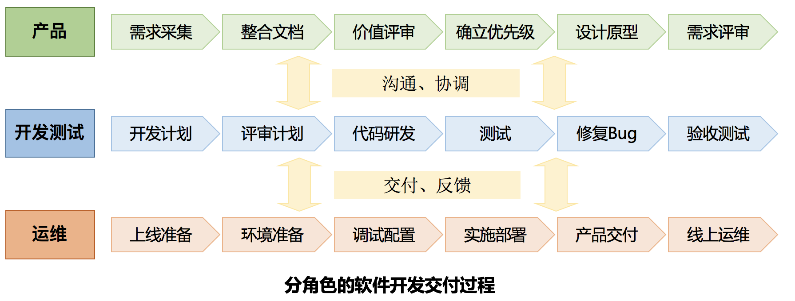
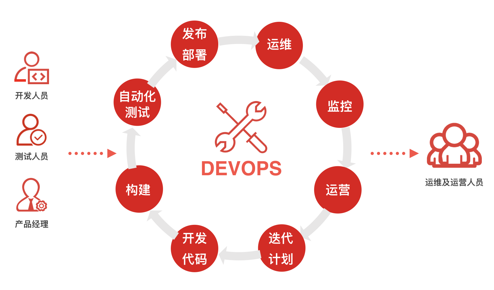
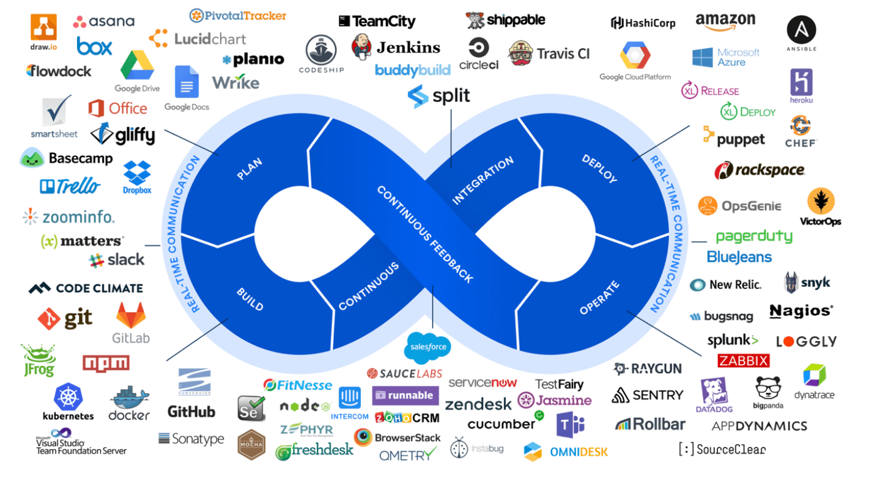
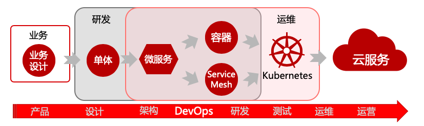
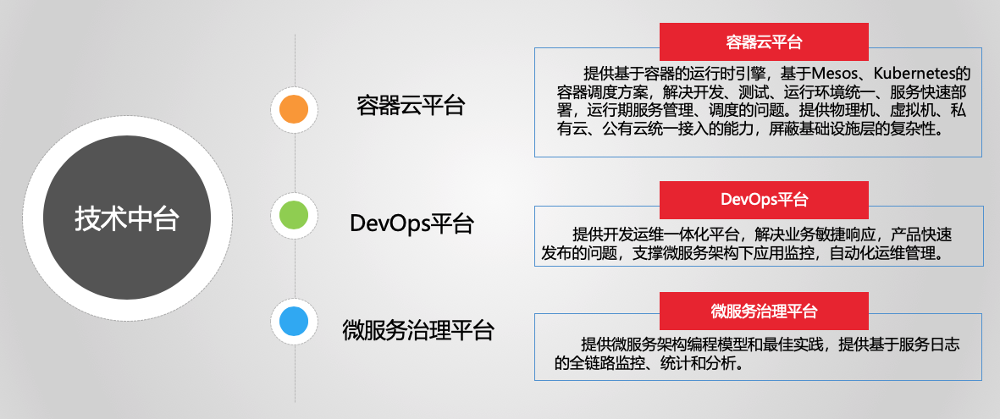
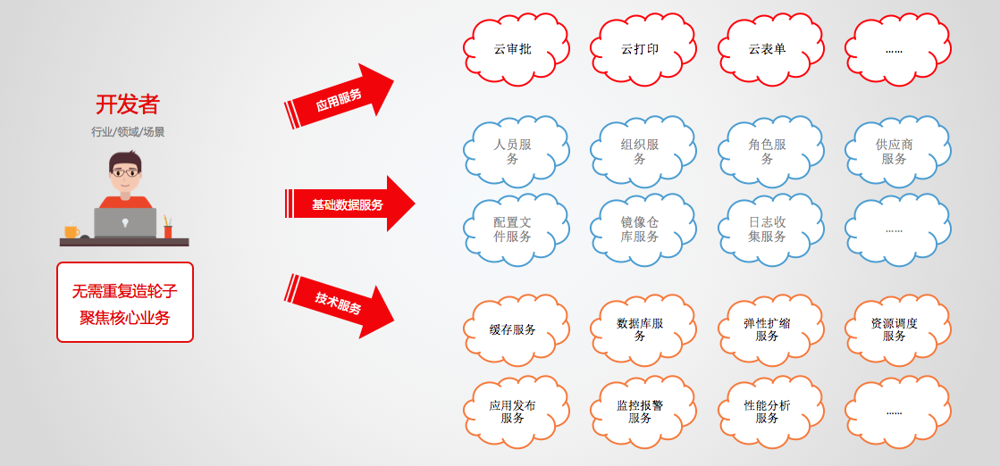
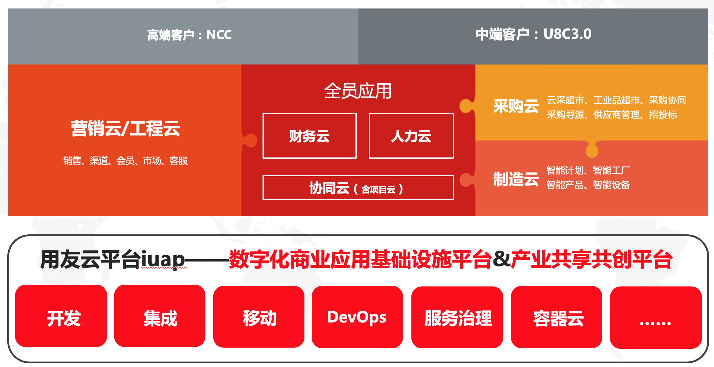

**企业需要拥有自己特色的DevOps**

#前言
----

    伴随时代的飞速进步，中国的人口红利带来了互联网业务的快速发展，巨大的流量也带动了技术的不断革新，研发的模式也在不断变化。只有确保自己比竞争对手更加敏捷、更加快速的响应数字化市场的变化，才能在这场数字经济革命中胜出。传统企业纷纷效仿互联网的做法，结合DevOps进行数字化的转型。
DevOps是Development（Dev）和Operations（Ops）的组合，它是一组过程、方法与系统的统称。可以把DevOps看作开发、运维和质量保障三者的交集。它经常被描述为可以提高开发团队与运营团队之间的协作，促进更高效的关系，最终更快地构建可靠性更高、质量更好的软件。因此对一个企业来说，适时引入DevOps能对产品交付、测试、功能开发和维护起到意义深远的影响。
那么传统企业在向数字化企业转型的过程中，如何更好的践行DevOps，适应IT技术变革，适配企业自有特色，满足业务系统的安全、合规、可控等诉求呢？本文将致力于探讨DevOps的落地方案，给出一些可行的方法及工具等。

##1. 引入DevOps可以为企业带来的优势
---------------------------------

    在DevOps问世之前，已具有多种软件开发与交付模式，如瀑布式、迭代式、敏捷式等等。然而，现实总是有更加复杂的情况需要应对，比如开发、测试、灰度、生产环境难以分离；各环境代码及配置混乱；手工部署工作量大、易出现失误，且部署时间长；无生命周期管理，资源循环慢。同时，开发、测试、运维人员之间，也有着高高的“部门墙”，相互之间沟通不畅等问题。

    由此，DevOps理念终于诞生了。它的出现，就是用来迎接日渐拆分的微服务以及互联网应用时代的到来。它从出生起变带有了互联网的基因，最初的目的是重视“软件开发人员（Dev）”和“IT运维技术人员（Ops）”之间沟通合作的文化，填补开发端和运维端之间的信息鸿沟，改善团队之间的协作关系，解决传统开发模式之痛，和计算机新时代下出现的更多问题。
    DevOps致力于产品从开发到落地的整个生命周期过程管理。DevOps的引入可以对产品交付、测试、功能开发和维护起到关键的影响。可以让开发与测试、运维之间的协作更快更高效。

##2. 践行DevOps，管理产品软件全生命周期
-------------------------------------

    所谓软件的生命周期，是指按照开发软件的规模和复杂程度，从时间上把软件开发的整个过程分解，形成相对独立的几个阶段的过程。其中每个阶段又分解成多个具体的任务，同时要求按规定顺序依次完成各阶段的任务，最后生产出高质量的软件。

    总体上说，软件的生命周期可分为以下几个阶段
###**1、需求获取与分析**
    从需求方，也就是客户处获取需求，确定软件的开发目标，对软件需要实现的各个功能进行详细分析。 
###**2、软件设计并制定迭代计划**
    通过架构设计、详细设计等，确定具体详细的开发方案，并制定研发计划。
###**3、开发代码**
    研发介入，依据迭代计划开发代码，将软件设计的结果转变成可执行的程序代码。
###**4、构建应用**
    通过继续集成等方法，将应用构建为可部署的应用包
###**5、自动化测试**
    测试及QA人员介入，利用测试工具，对研发开发的代码进行严格的测试，发现软件中存在的问题并反馈，保证产品的质量。
###**6、发布部署**
    实施及运维人员介入，将软件产品部署至生产环境中，使产品真正面对客户服务。
###**7、运行维护**
    线上运维人员按照规范及手册，对线上环境实时维护，保障产品稳定运行。

    可以看到，软件的生命周期复杂，涉及到的环节颇多。在此背景下，为实现DevOps的落地，需要考虑确定DevOps的落地原则，并依此或自开发软件工具，或利用市场现有的工具，整合至现有的团队之中。

##3. DevOps落地的基本原则

-----------------------

    想要落地并做好DevOps，就需要开发者站在客户的视角，来确定企业从设计到生产交付的全部过程，由此才能最大程度的实现客户需求。之所以运用DevOps，就是要发挥出DevOps的能力，提升软件研发及交付效率，提高产品质量。
对DevOps的落地原则整理归纳后，DevOps落地模式可以归结为以下3点。

###**1、基础设施即代码原则**

    利用代码对基础设施进行管理与配置，并形成模板可供复用。这样的好处是仅需要修改部分配置，即可快速创建一套工作环境，这里的工作环境包括虚拟机、网络、负载均衡器以及数据库等。利用DevOps将重复的事情简化，使用自动化脚本或软件来实现。

###**2、持续集成、持续部署、持续交付原则**

    软件开发版本频繁，需要快速的将分支版本集成到主分支，并将代码交付给测试及质量团队，进行测试和评审。评审通过后，代码就进入生产阶段，自动部署到生产环境交付给用户使用。利用此原则，可以让产品可以快速进行迭代，同时还能保证高质量。

###**3、合作文化原则**

    DevOps一直强调着部门间的沟通与合作，一个有着协同合作氛围的公司，有利于促成最终产品的高质量。传统的软件开发模式中，工作交流方向是从研发，到测试，再到运维；而DevOps鼓励团队建立并缩短从后至前的反馈回路，即扩大测试和运维向研发的反馈，以便更快更多地将其意见融入到产品之中，使问题得到修正，使产品质量继续向前迈进，从而更符合最终用户的需求。 

###4. 实现DevOps的工具链

    在企业处于数字化转型的新时期，面对DevOps的具体落地，市场上已提供了大量的现有第三方工具可以选择。比如，以下几种工具经常使用：git、Maven、GoCD、Selenium、ElasticSearch、Prometheus等。他们都是DevOps技术栈的典型代表，也可以说是必不可少的DevOps支撑技术。
    在众多的技术中，有一些新时代的神器不得不提及，比如Docker、Kubernetes、Jenkins、SpringCloud、Service Mesh等。

    Docker的出现可谓是极大的推动了DevOps的发展，让DevOps重新燃起新的青春。Docker最大的颠覆在于镜像的理念，将应用所需的依赖环境，全部隔离起来，让应用的部署插上了翅膀。基于容器来构建服务栈的方式也变得非常优雅，远远超越了自动化脚本的方式。
    企业在进行技术革新换代的大跃进中，将原有的一个个臃肿的大单体应用，拆分为了众多的微服务，但是伴随着服务数的增多，很快出现了新的问题，如何更好的运维、如何更好的发布这些微服务、如何处理好这些服务的各套环境间调用污染？

    Kubernetes代表了新一代云计算热潮的PaaS平台技术方案，可以简单的类比为OpenStack、CloudFoundry的替代方案（当然还是有很多不同之处的）。作为容器集群管理系统，为容器化的应用提供部署运行、资源调度、服务发现和动态伸缩等一系列能力，可以将容器编织成一个大大的云。
    Docker容器的出现，从另一个角度来讲，极大的促进了微服务的发展，每一个容器可以形象的打包为一个个的小盒子，而微服务就是装在小盒子里面的宝藏。微服务在容器中运行起来以后，每一次的服务调用，就像是在不断散发光芒。
容器的这种一致性特点，彻底的颠覆了PaaS平台的构建方式，让企业进行数字化落地也有了更好的选择。尤其是弹性伸缩、自定义网络、环境隔离等特性，使得我们可以结合Docker镜像和Compose编排实现更好的CI、CD。应用从源码态到运行态的过程，经过Docker容器穿插在一起，一条链路就可以完美的跑下来。以下是可供参考的基于DevOps工具链的平台架构：

    有了上面的这些神器，一个基于DevOps理念的PaaS平台就基本落地了，但人类不止于这点小进步，在服务调用的层面不断开拓创新，提出了更优秀先进的提升方案，于是就有了Service
Mesh。

Service Mesh
    又译作“服务网格”，作为服务间通信的基础设施层，是云原生应用的必要支撑，可以将它比作是应用间的TCP/IP，负责应用间的网络调用、限流、熔断和监控，可以将网络功能从代码中剥离出来。采用Service Mesh，你不用在服务代码中实现用于可靠通信的模式如断路、超时等，类似地，Service Mesh
也提供了服务发现、服务可见性等其他功能。

###5. 用友云技术中台助力打造企业特色DevOps

    用友云平台定位于数字化商业应用基础设施平台&产业共创共享平台，主要构成为3+2+1，即3大中台（业务中台、技术中台和数据中台），2大服务（混合云服务和生态服务），1个开发平台（面向用友所有客户和生态的统一开发平台）。

    用友云技术中台的核心底层基础支撑，主要由容器云平台、DevOps平台和微服务治理平台三部分构成。

    容器云平台可以从底层提供运行时引擎支撑，基于Kubernetes容器调度，基于Docker解决应用统一封装的问题，保证应用可以在不同的计算资源自由迁移。DevOps平台可以打通开发、测试、运维的全流程，唯快不破的时代，加速产品的迭代，并通过全面的监控报警手段，为业务保驾护航。微服务治理平台可以对基于微服务架构的应用运行进行管控，提供熔断、限流、容错的基础支撑，让微服务的运行更可靠。

-----------------------

    用友云技术中台包含了很多亮点功能，值得一提的当属DevOps流水线功能。
DevOps流水线，是开发者中心提供的一种持续交付能力，它以应用为中心，在技术层面将应用持续交付过程中的各个环节打通，形成自动化持续交付工作流，最终打造为一条结构完整的流水线。

    使用DevOps流水线，可以实现应用快速发布需求，缩短构建、部署、测试、上线的迭代周期，有利于产品研发、实施和发布的标准的推进。同时，它提供了简单易用的可视化图形界面，研发和运维人员无需学习复杂的造作指令，即可完成应用的构建、部署、上线等操作。
    目前，已经有许多企业将其产品利用技术中台提供的DevOps流水线能力，将大型产品中的各个服务部署于用友云平台中。平台其稳定、可靠、高效便捷的操作，收到了客户的一致赞扬。
    以用友云U8C3.0为例，其下领域包括营销云，财务云，平台，协同人力等众多，涉及应用服务100多个。技术中台根据实际情况，对相应的产品和领域拆分，规划，并建立各个应用对应的流水线。同时，技术中台对其产品对环境的要求，也做了充足的支持，建立了测试环境、日常环境、预发环境、生产环境等，满足了U8C3.0各种业务场景的需要。

    基于用友云技术中台，企业可以打造出各种形态的稳定服务。技术支撑服务方面，可以打造企业自己的缓存服务、数据库服务、弹性扩缩服务、监控报警服务等；基础数据服务方面，可以打造企业专属的人员服务、组织服务、角色服务、配置服务、镜像仓库服务等；应用服务方面，企业可以根据自身的业务特点和诉求，构建像审批、打印、表单等服务。

    DevOps目前已有大量丰富的工具可以选择，用友云技术中台也提供了强大的DevOps能力，企业可以根据团队的实力和实际状况，选择适合自己的工具和产品，达到企业快速上云，实现数字化的目标。想要真正的转型成功，还需要工具、规范、文化、技术、业务等全方位配合，匹配到企业的发展节拍，打造企业的专属竞争力，创造新的业务增长奇迹。

